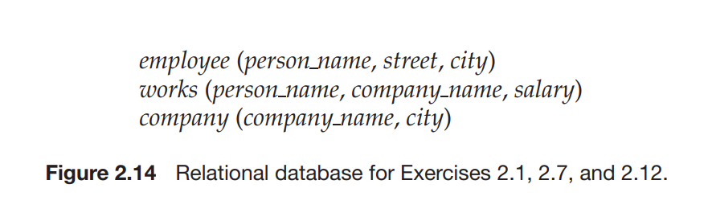
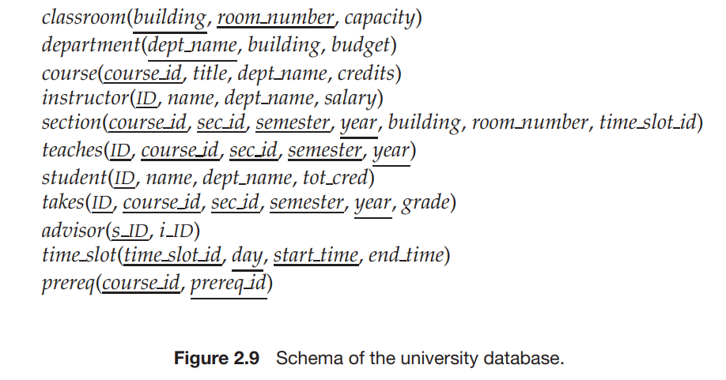

# Overview

This is my attempt to solve few problems from the book "Database System Concepts" by Avi Silberschatz, Henry Korth, and S. Sudarshan. This file considers the second chapter of the book. 

# 2.1

Consider the relational database of Figure 2.14. What are the appropriate primary keys? 

The main idea here is that primary keys are used to identify a rows uniquely. 

1. employee: employee_name (not necessarily unique, but the best candidate out of street, city and person_name)
2. company: company_name
3. works: person_name, company_name (assuming company_name is an primary key, then the combination of person_name and company_name is a candidate key)

# 2.2

 

Consider the foreign key constraint from the dept name attribute ofinstructor to the department relation. Give examples of inserts and deletes to these relations, which can cause a violation of the foreign key constraint ?

* How can an insert violate a foreign key constraint ? 

- Inserting a new tuple with a foreign key that does not exist in the referenced relation. 

* How can a delete violate a foreign key constraint ? 

- Deleting a tuple whose primary key is referenced as a foreign key in another relation.  

A concrete example for this exercice: 

- insert a new instructor with a department name that does not exist in the department relation.  

- delete a department that has instructors associated with it.  

# 2.3
Consider the time slot relation. Given that a particular time slot can meet more than once in a week, explain why day and start time are part of the primary key of this relation, while end time is not ? 

The time slot with the same id can take place multiple times in a week. So, given an id, the day and the start time uniquely identify that specific instance of the time slot. end_time does not need to be part of the primary key because, two time_slot instances cannot have the same id, day, start_time and end_time too. 

# 2.4
In the instance of instructor shown in Figure 2.1, no two instructors have the same name. From this, can we conclude that name can be used as a superkey (or primary key) of instructor? 

- We cannot possibly consider the name as a primary key even if the current instance of instructor relation has no two tuples with the same name. We cannot guarantee that the instructor instance in the future will not have two tuples with the same name. Hence, the relation should not be designed with the name attribute as a primary key.  

# 2.7 

- $\pi_{person\_name} (\sigma_{city="Miami"} (employee)) $

- $\pi_{person\_name} (\sigma_{salary>100000} (works)) $

- $\pi_{person\_name} (\sigma_{city="Miami"} (employee) \bowtie \sigma_{salary>100000} (works)) $

it is much more efficient to apply the selectio operator first to each relation and then apply the join operator. 

# 2.12

Consider the relational database of Figure 2.14. Give an expression in the relational algebra to express each of the following queries:

a. Find the names of all employees who work for "First Bank Corporation".

b. Find the names and cities of residence of all employees who work for
"First Bank Corporation".

c. Find the names, street address, and cities of residence of all employees
who work for "First Bank Corporation" and earn more than $10,000

- $\pi_{person\_name} (\sigma_{company\_name="First Bank Corporation"} (works))$

- $\pi_{person\_name, city} (\sigma_{company\_name="First Bank Corporation"} (works) \bowtie employee)$

- $\pi_{person\_name, street, city} (\sigma_{company\_name="First Bank Corporation" \wedge salary>10000} (works) \bowtie employee)$

# 2.13

Consider the bank database of Figure 2.15. Give an expression in the relational algebra for each of the following queries:

a. Find all loan numbers with a loan value greater than $10,000.

$\pi_{loan\_number} (\sigma_{amount>10000} (loan))$

b. Find the names of all depositors who have an account with a value
greater than $6,000.

$\pi_{customer\_name} (depositor \bowtie \sigma_{balance>6000} (account))$

c. Find the names of all depositors who have an account with a value
greater than $6,000 at the "Uptown" branch. 

$\pi_{customer\_name} (depositor \bowtie \sigma_{balance>6000 \wedge branch\_name="Uptown"} (account))$

# 2.14

List two reasons why null values might be introduced into the database. 

- The value is unapplicable. For example, the time of death of a person who is still alive.  

- can server as a temporary value. for example, setting the department foreign key in a professor relation to null because the department was terminated until all professors are either let go or transferred to another department.  

