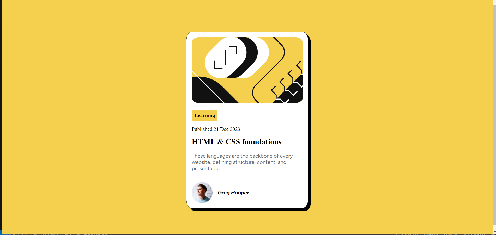

# Frontend Mentor - Blog preview card solution

This is my solution to the [Blog preview card challenge on Frontend Mentor](https://www.frontendmentor.io/challenges/blog-preview-card-ckPaj01IcS) 

## Table of contents

- [Context](#overview)
  - [Screenshot](#screenshot)
  - [Links](#links)
- [My process](#my-process)
  - [Main Ideas](#built-with)
  - [Next Steps](#continued-development)
  - [Useful resources](#useful-resources)
- [About Me](#author)

## Context
A bit of context; I am a recent Computer Science Graduate with a focus on Data Science. I am broadening my employment opportunities by picking up other skills suck as Web Dev. I am focused on learning what I would consider the most important aspects in Front-end: the layout and the visual structure of the site. More specifically, I do not concern myself with the details (exact color, font size, font family, border...) as my main goal is to write HTML AND CSS code where I have a firm grasp of the expected visual behavior of my elements. (I am planning to focus on the backend side after having a good understanding of Front-end basics)

### Screenshot

### Links

- [Solution URL](https://github.com/ayhem18/Towards_SE/tree/main/front-end-projects/FrontEndMentor/NewBieProjects/Blog_preview_card)
- [Live Site Url ](https://ayhem18.github.io/Towards_SE/front-end-projects/FrontEndMentor/NewBieProjects/Blog_preview_card/)

## My process

### Main Ideas
1. using flex layout at different levels
2. using more sophisticated units such as vh, rem

### Next steps
1. go through the newBie Learning path as fast as possible
2. focus on understnding the Grid and flex layout (mainly how they interact with the box model) in different positioning modes (fixed, absolute, relative)
3. better understanding of units.

### Useful resources
- The best video on the [flex layout](https://www.youtube.com/watch?v=u044iM9xsWU&t=137s)

## About Me:
- Github - [Ayhem Bouabid](https://github.com/ayhem18)
- Frontend Mentor - [@ayhem18](https://www.frontendmentor.io/profile/yourusername)
