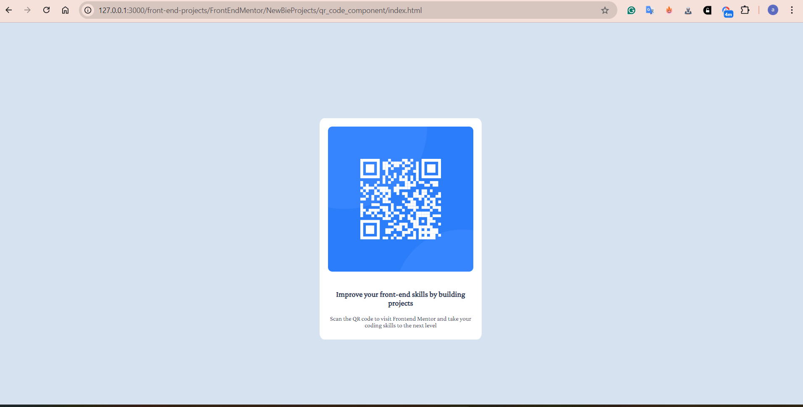

# Frontend Mentor - QR code component solution

This is my solution to the [QR code component challenge on Frontend Mentor](https://www.frontendmentor.io/challenges/qr-code-component-iux_sIO_H).

## Table of contents

- [Context](#overview)
  - [Screenshot](#screenshot)
  - [Links](#links)
- [My process](#my-process)
  - [Main Ideas](#built-with)
  - [Next Steps](#continued-development)
  - [Useful resources](#useful-resources)
- [About Me](#author)

## Context
A bit of context; I am a recent Computer Science Graduate with a focus on Data Science. I am broadening my employment opportunities by picking up other skills suck as Web Dev. I am focused on learning what I would consider the most important aspects in Front-end: the layout and the visual structure of the site. More specifically, I do not concern myself with the details (exact color, font size, font family, border...) as my main goal is to write HTML AND CSS code where I have a firm grasp of the expected visual behavior of my elements. (I am planning to focus on the backend side after having a good understanding of Front-end basics)

### Screenshot

### Links

- [Solution URL](https://github.com/ayhem18/Towards_SE/tree/main/front-end-projects/FrontEndMentor/NewBieProjects/qr_code_component)
- [Live Site Url ](https://ayhem18.github.io/Towards_SE/front-end-projects/FrontEndMentor/NewBieProjects/qr_code_component/)

## My process

### Main Ideas
I only used HTML and CSS. The main ideas: 

1. setting a container for the 3 components: (the image and the 2 paragraphs) such that: 
  * position: 'fixed'
  * 40% to the left and 40% to the right of the viewport 
  * width=20% and the element is centered nicely

2. each sub component will be of width: 90% and of margin: 5% so each sub-component will be centered nicely within the container

### Next steps
1. go through the newBit Learning path as fast as possible
2. focus on understnding the Grid and flex layout (mainly how they interact with the box model) in different positioning modes (fixed, absolute, relative)
3. better understanding of units.

### Useful resources
- [positioning](https://developer.mozilla.org/en-US/docs/Learn/CSS/CSS_layout/Positioning). Great intro to positioning

## About Me:
- Github - [Ayhem Bouabid](https://github.com/ayhem18)
- Frontend Mentor - [@ayhem18](https://www.frontendmentor.io/profile/yourusername)

